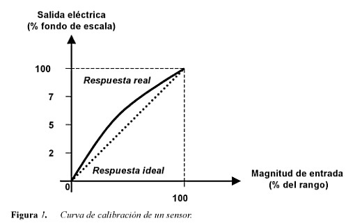
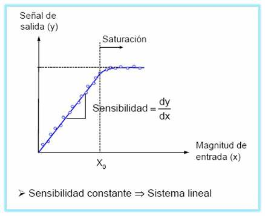
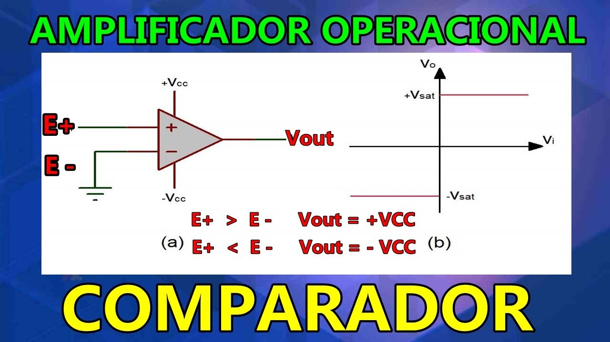
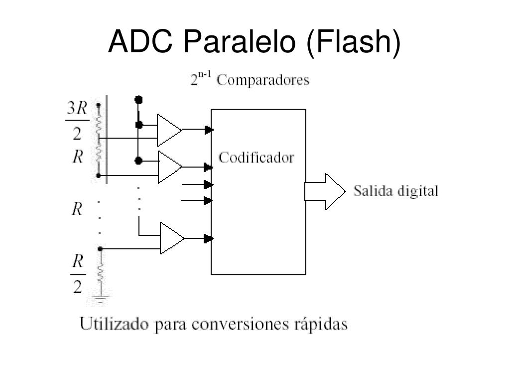

# Sistemas de Medición:

## Rango (Alcance)

Se especifica según sus valores mínimos y máximos de su entrada y su salida

Definición de sensor:

- entrada como variable física
- entrega a la salida una señal de electricidad(Continua y Discreta) como mínimo 0V y como max 5V.
- Importate saber el rango de salida del sensor tomando en cuenta la entrada de control siguiente al sensor.
- Si está fuera de los límites, se debe poner un acondicionador de señal entre el sensor y el control (cero y span o divisor de tensión).

$$V_o = V_i \frac{R_2}{R_1 + R_2}$$

- Problema del divisor: Problemas de impedancias(Acondicionamiento defectuoso), se debe **acoplar impedancias** entre los dos sistemas.

## Intervalo (Span)

Para la entrada: $I_{max} - I_{min}$ y para la salida: $O_{max} - O_{min}$

## Curva de Calibración

Relación directa, punto a punto, de la señal de salida en función de la entrada.

- Cada transductor/sensor tiene su propia curva de calibración.
- Sinónimo: Curva de respuesta en amplitud

## Sensibilidad

La relación del incremento de la respuesta con respecto al incremento de la señal de entrada (derivada).
- Derivada (pendiente) de la curva de calibración en un punto.

## Linealidad

Un elemento es lineal si la sensibilidad es constante (1), se usa para saber la curva de calibración ideal

$$O=_{ideal} = \frac{O_{max} - O_{min}}{I_{max} - I_{min}}$$

### Error de linealidad

Máxima diferencia: $N(I_m) = \left| O(I_m) - (K I_m + a) \right|$

- También se puede hallar encontrando las diferencias punto a punto en toda la curva, el punto en el que la diferencia es máxima, es el error de linealidad

## Resolución

Es el cambio de señal más pequeño que puede ser observado.

### Cuantificación

Amplitud de una señal continua un un número finito de valores (Conversión análogo digital ADC).
- Puede existir un error entre la amplitud de la señal real y la codificada. $Resolución = \frac{V_{max}}{2^{n}}$

### ADC

**Convertidor en paralelo(flash):**

$V_{ref} = V{max}$, $bits = 2^{No_{amplificadores}}$

## Precisión

Qué tan cercana está la lectura al valor real (error).

- $Error absoluto = Valor medido - Valor Real$
- $Error Relativo = \frac{Error Absoluto}{Valor Real} * 100$