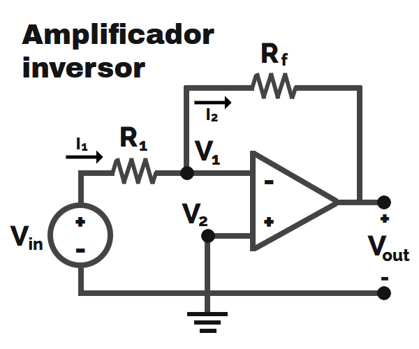

# Amplificadores Operacionales

## no inversor

## Polarización de entrada

Módulos amplificadores de instrumentación: INA128, INA129

Módulo amplificador, con optoacoplador(protección): AMC1301

Circuitos ajuste de cero y span: 

[Link zero and span circuits](https://waijung1.aimagin.com/zerospan_circuit.htm)

## Ejercicio Diseño:

Tengo un sensor de salida 0.5 a 1,5 Vdc, debe viajar con una corriente de 4 a 20mA hasta un sistema de adquisición con entrada de 0 a 3v3

**R/** Se debe utilizar un circuito $\frac{V}{I}$ -> $\frac{I}{V}$ tipo resistencia shunt con un INA128 y luego un circuito de cero & span si es el caso.

# Filtros Activos:

**Butterworth:** Máximamente plana en la banda de paso, en respuesta a pulso, tiene pequeñas oscilaciones a la salida.
**Chevishev:** Mejor caída en frecuencia de corte.
**Vessel:** Muy estable, mala caída en frecuencias de corte. 

## Tipos de filtros:

**Filtro pasa todo:** Sirve para modificar la fase, sin necesidad de rechazar ninguna frecuencia.