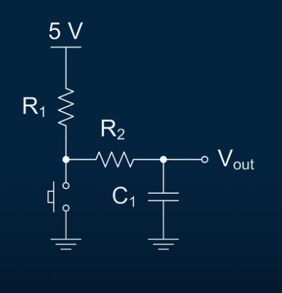

# Enunciado:

1. Qué son y cómo usar interrupciones (Arduino).

Ejemplo práctico de interrupciones

Ejercicio a realizar: Implementar el conteo de pulsos recibidos de un circuito con antirrebote (debouce) por hardware y software y mostrarlo en el monitor serial.

## Debounce hardware circuits:

